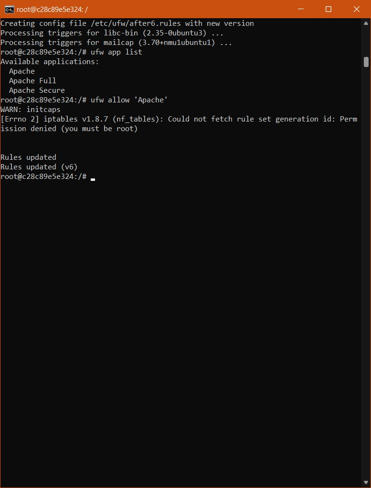

<div align="center">
<table>
    <theader>
        <tr>
            <th></th>
            <th>
                <span style="font-weight:bold;">UNIVERSIDAD LA SALLE</span><br />
                <span style="font-weight:bold;">FACULTAD DE INGENIERÍAS</span><br />
                <span style="font-weight:bold;">DEPARTAMENTO DE INGENIERÍA Y MATEMÁTICAS</span><br />
                <span style="font-weight:bold;">CARRERA PROFESIONAL DE INGENIERÍA DE SOFTWARE</span>
            </th>            
        </tr>
    </theader>
    
</table>
</div>

<div align="center">
<span style="font-weight:bold;">GUÍA DE LABORATORIO</span><br />
</div>

<table>
    <theader>
        <tr><th colspan="2">INFORMACIÓN BÁSICA</th></tr>
    </theader>
<tbody>

<tr><td>TÍTULO DE LA PRÁCTICA:</td><td>Docker</td></tr>
<tr><td colspan="2">RECURSOS:
    <ul>
        <li><a href="https://www.docker.com/">Sitio oficial del Proyecto Docker</a></li>
        <li><a href="https://github.com/moby/moby">El Proyecto Moby</a></li>
        <li><a href="http://www.haifux.org/lectures/320/netLec8_final.pdf">Contenedores de Linux y la nube del futuro</a></li>
        <li><a href="https://dondocker.com/orquestando-contenedores-docker-para-tener-un-joomla-y-un-mysql-en-diferentes-hosts/">Joomla y MySQL con Docker</a></li>
        <li><a href="https://www.youtube.com/watch?v=VeiUjkiqo9E#t=60">Tutorial de docker en Youtube</a></li>
        <li><a href="https://web.archive.org/web/20130808043357/http://www.linux.com/news/enterprise/cloud-computing/731454-docker-a-shipping-container-for-linux-code/">Docker: un 'Desplegador de contenedores' para el código de Linux</a></li>
        <li><a href="https://www.ionos.es/digitalguide/servidores/configuracion/tutorial-docker-instalacion-y-primeros-pasos/">Tutorial de Docker: instalar y gestionar la plataforma de contenedores</a></li>
        <li><a href="https://hub.docker.com/">Docker Hub</a></li>
        <li><a href="https://www.digitalocean.com/community/tutorials/how-to-install-and-use-docker-on-ubuntu-20-04-es">Cómo instalar y usar Docker en Ubuntu 20.04</a></li>
    </ul>
</td>
</<tr>
<tr><td colspan="2">ESTUDIANTE:
    <ul>
        <li>Valeria Alejandra Goyzueta Torres  - vgoyzuetat@ulasalle.edu.pe</li>
    </ul>
</td>
</<tr>
</tdbody>
</table>

## OBJETIVOS Y TEMAS

### OBJETIVOS
- Aprender a desplegar contenedores con Docker.

### TEMAS
- Docker.
- Docker vs VMs
- Arquitectura de Docker
- Comandos en Docker

## EJERCICIOS PROPUESTOS

-   1. Realice los cambios necesarios para que la imagen que ud creo a partir de un contenedor personalizado se pueda acceder al servidor web desde el equipo anfitríon.
    ```sh
    docker run -p 8088:80 rcd22image
    ```
    
    Primero a tener en consideración que se han ejecutado todos los comandos colocados por el profesor, y las modificaciones se muestran luego. Primero hasta el punto     donde se han llegado a implementar los comandos con sus capturas de pantalla:
    
    *apt-get install apache2
    etc/init.d/apache2 start
    /etc/init.d/apache2 status*
    <p align="center">
        
    </p>
    Se muestra la ejecución del comando de instalación inicio y estado después de haber sido ejecutados en la consola del contenedor Docker
    
    *ufw app list
    ufw allow 'Apache'
    ufw app list*
    <p align="center">
        
    </p>
    Ejecución luego de haber habilitado el comando ufw para Apache en Ubuntu (contenedor de Docker)
    
    *apache2ctl enable apache2*
    <p align="center">
        
    </p>
    Ejecución del inicio del servidor apache, al iniciar el contenedor
    
    **MODIFICACIÓN DEL ARCHIVO INDEX.HTML**
    Este archivo se encuentra en el fichero var/www/html, y procederemos a eliminar su contenido por defecto y dejar un mensaje que se muestre al ingresar a nuestro       servidor desde nuestro computador anfitrión, esto haciendo uso del comando: *echo mensaje > index.html* dentro del fichero ya mencionado:
    <p align="center">
        
    </p>
    
    Una vez modificado ello, procederemos a salir del contenedor y crear una imagen de las modificaciones con el comando *docker commit idcontainer nombreimagen*:
    <p align="center">
        
    </p>
    
     Finalmente corremos la imagen con el comando *docker run -p 8888:80 --name=nombrecontainer nombreimagen apache2ctl -D FOREGROUND*
     <p align="center">
        
    </p>
    
-   2. Crear dos contenedores que puedan comunicarse: ping.
   
    Para la creación de dos contenedores, que son los encargados de hacerse ping se tiene que tener una red en común entre ambon contenedores, para que estos ya puedan     comunicarse. Primero, hay que tener en consideración que ya hayamos hecho un pull a alguna imagen y hayamos creado unos contenedores que surgen en base a esa           imagen a la que le hemos hecho pull. Para ello usamos el comando *docker pull debian*, y en base a ello, crearemos dos contenedores, haciendo uso del comando           *docker create --name nombre imagen*. 
    <p align="center">
        
    </p>
    
    Una vez realizado eso, se crea una red a las que vamos a conectar nuestros contenedores *docker create network nombredelared*. y corremos los contenedores: *docker     run --network red --name nombre nombreimagen*.
    <p align="center">
        
    </p>
    
    Instalaremos los paquetes necesarios para poder hacer ping y haremos ping, entre ambos contenedores con el comando *ping direccionip*, corroborando de esta manera      que pertenecen a la misma red.
    <p align="center">
        
    </p>
    <p align="center">
        
    </p>
    
-   3. Investigar acerca de la ejecución de programas con interfaz gráfica dentro de contenedores Docker.
    
    Para la ejecución de programas con GUI, en Docker es necesario la elaboración de una serie de pasos en específico. Pero primero, hay que tener en concepto que         Docker es una aplicación diseñada para poder colocar en conenedores aquellas aplicaciones orientadas a nivel de servidor. A nivel de ejemplo en una aplicación web     que cuenta con servidor para el front, back, data, y otros componenentes que se encuentran en la nube Docker puede correrlos a nivel de consola, se cree que no se     puede correr programas con GUI en Docker, pero esto es falso, pues es posible conectando el "display" de la computadora anfitriona al contenedor. A nivel de pasos,    quedaría mas o menos de la siguiente manera:
    
    <ul>
        <li>Creación del dockerfile: Que instale xauth y el programa que querramos correr</li>
        <li>Copia la Cookie para conectar el "display" del servidor x con el comando: **xauth list** en Linux</li>
        <li>Construye la imagen de Docker</li>
        <li>Construye y corre el contenedor de Docker</li>
        <li>Añade la cookie a la lista</li>
        <li>Corre la instancia del programa que se quiera desde la consola, con el comando que sea que corra el programa</li>
    </ul>
#

## CUESTIONARIO

- ¿Qué son los "cgroups" del kernel de Linux? y ¿Qué diferencia más interesante encontró entre las versiones 1 y 2?
 
    Los cgroups, que en su forma no abreviada se conocen como: "control groups" es una característica del kernel de Linux que permite limitar, llevar cuenta y aislar       los recursos de uso: CPU, memoria, etc. De un grupo de procesos. Permite organizar los procesos de una manera jerárquica los cuales son limitados y monitoreados.       Esta jerarquía se define creando, eliminando y renombrando subdirectorios dentro del sistema de archivos cgroup. Existen diversas difencias entre ambas versiones       sacadas a la luz computacional, entre ellas tenemos: 
    
    La versión 1 posee la particularidad de que un proceso puede pertenecer a muchos subgrupos, si esos subgrupos están en diferentes jerarquías con diferentes             controladores adjuntos. Pero, como la pertenencia a más de un subgrupo dificulta la desambiguación de la pertenencia a un subgrupo. Adjunto un enlace de control de     los recursos de la computadora haciendo uso de los cgroup de esta versión: 
    https://access.redhat.com/documentation/en-us/red_hat_enterprise_linux/8/html/managing_monitoring_and_updating_the_kernel/setting-limits-for-applications_managing-monitoring-and-updating-the-kernel#setting-cpu-limits-to-applications-using-cgroups-v1_setting-limits-for-applications
    
    La versión 2 cuenta con la característica de que sólo se pueden crear subgrupos en una única jerarquía. Además de solamente tener la particularidad de poder           adjuntar procesos a las hojas de la jerarquía. No se puede adjuntar un proceso a un subgrupo interno si tiene algún controlador habilitado. La razón detrás de esta     regla es que los procesos en un determinado subgrupo que compiten por los recursos con los hilos adjuntos a su grupo padre crean importantes dificultades de           implementación. Finalmente la segunda versión un proceso puede pertenecer solamente a un subgrupo.

- ¿Qué son los "namespaces" del kernel de Linux? y ¿Cuáles son los tipos de "namespaces"?

    Los "namespaces" del kernel de Linux son "administradores" que permiten encapsular recursos globales de manera aislada, evitando de esta manera que puedan             interferir con procesos que se encuentren en ese momento fuera del mismo namespace, sin la necesidad de tener que salir de las máquinas virtuales. Los cambios o       alteraciones que se hagan a este recurso global aislado es visible para todas aquellos procesos que formen parte del namespace, pero invisibles para el resto. Los     namespaces ayudan a la implementación de contenedores. Existen 7 tipos:
    
    <ul>
        <li>Mount</li>
        <li>Process</li>
        <li>Interprocess Communication</li>
        <li>Network</li>
        <li>User</li>
        <li>UTS</li>
        <li>cgroup</li>
    </ul>

- ¿Qué diferencia puede resaltar entre LXC y libcontainer?
    
    Ambas son plataformas de contenedores que se comunican con el kernel de la máquina anfitriona, pero las principales diferencias entre ambas plataformas son las         siguiente: Los contenedores de Linux (LXC) son más flexibles en el diseño, y son mucho más cercanos a las máquinas virtuales. Estos mecanismos ayudan al control       del uso de recursos y la visibilidad de procesos con el resto del sistema. Por otra parte los contenedores de Docker (libcontainer) están específicamente orientado     a aplicaciones de microservicios, lo que lo hace más simple y sin la necesidad de conocer Linux. Otra de las grandes diferencias se encuentra en la velocidad,         mientras que los LXC se demoran un poco más descargando las imágenes, Docker se demora menos tiempo, pero es insignificante. En cuestión a la seguridad, los           contenedores de Linux presentan una mayor protección pues Docker requiere de atención de ingeneros en seguridad. Con respecto al aspecto de la escalabilidad, los       LXC son menos escalables que los contenedores de Docker, pues las imágenes no son más livianas que las máquinas virtuales o físicas. Con Docker puedes dividir tu       aplicación en diversos contenedores que almacenan funcionalidades.


- Investigue acerca del malware Doki y explique brevemente.

    El malware Doki es un trojano backdoor que hace uso de la API de la criptomoneda DogeCoin, para poder extraer el nombre del dominio de su servidor Comando y           Control: máquina que permite la ejecución de comandos en tiempo real pertenecientes a la botnet a manos de un delincuente. Para determinar la ddirección del           dominio este malware usa DynDNS que permite actualizar en tiempo real nombre de dominio y el algoritmo dinámico DGA, que permite generar dominios basados en la         criptomoneda DogeCoin. Esto permite a Doki cambiar de servidor de donde recibe sus comandos, siendo dificil permtir su rastreo.

    Este malware saca provecho de de los sistemas comprometidos para escanear la red en búsqueda de puertos asociados con Redis, SSH, Docker y HTTP; utilizando             herramientas de escaneo como zmap, zgrap y jq. Por ello se recomienda proteger las API de Docker hacia internet haciendo uso de una VPN además de aplicar prácticas     de seguridad explicadas en los manuales de Docker. 

- ¿Hasta que punto la empresa RedHat se ha comprometido con el proyecto Docker?
 
    La empresa desarrolladora de Docker se ha comprometido bastante con Docker, hasta tal punto de generar certificaciones por el manejo correctoo de esta herramienta,     entre las certificaciones más frecuentes se encuentra la de: ***Red Hat Certificate of Expertise in Container Administration***. Que en entos momentos es una           certificación retirada, pero hasta ese punto ha llegado la empresa. Para obtener la certificación, se daba un examen que era la prueba de este título del manejro       de esta herramienta basada en contenedores: https://www.redhat.com/es/services/certification/rhcoe-atomic-host-container-administration

#

## REFERENCIAS
-   [Sitio oficial del Proyecto Docker][Docker-site]
-   [Proyecto Moby][Moby-Github]
-   [Diapositivas "Contenedores de Linux y la nube del futuro" por Rami Rosen][Containers-PDF]
-   [Docker para un proyecto Joomla-MySQL][Joomla-MySQL]
-   [Tutorial de Docker en Youtube][Docker-Tutorial-Youtube]
-   [Cómo instalar y usar Docker en Ubuntu 20.04][Cómo instalar y usar Docker en Ubuntu 20.04]

#

[Docker-Hub]: https://hub.docker.com/

[Cómo instalar y usar Docker en Ubuntu 20.04]:https://www.digitalocean.com/community/tutorials/how-to-install-and-use-docker-on-ubuntu-20-04-es
